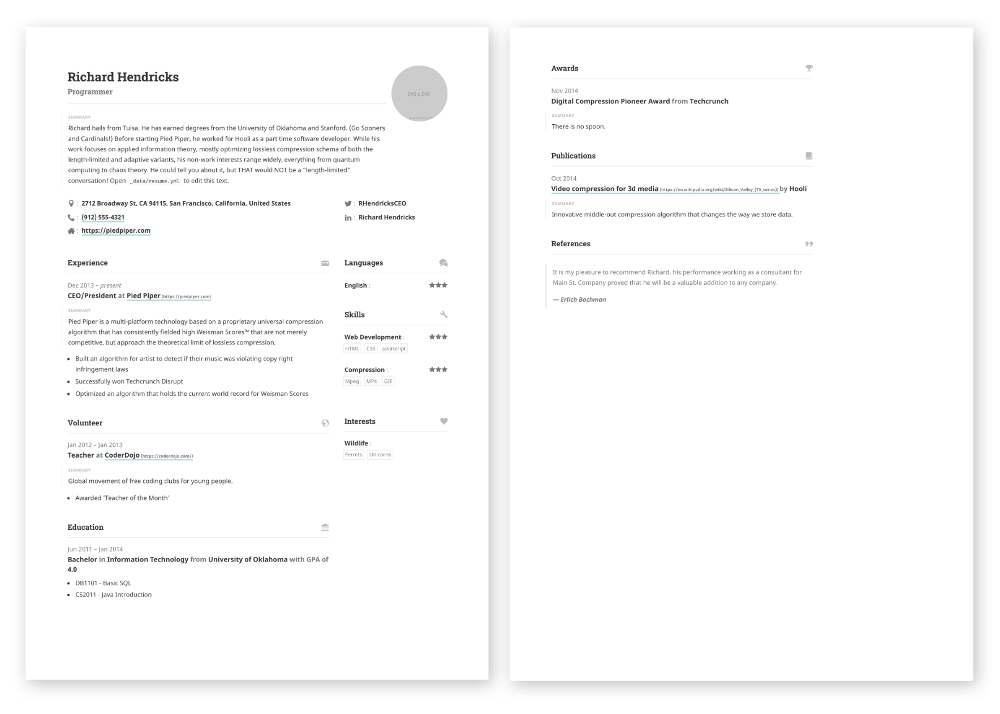

# About

<!--author-->

1. this list will be replaced by the toc
{:toc .large-only}

## Mission
Neue Technologien kommen und gehen, viele werden schnell wieder vergessen doch einige wenige bleiben auf Dauer erhalten. In vielen Unternehmen ist es einfach nicht möglich, jede neue Technologie zu evaluieren und auf einen sinnvollen und gewinnbringenden Einsatz im Geschäftsprozess zu überprüfen. Oftmals bringt auch nur eine bestimmte Kombination von unterschiedlichen Technologien und Prozessen den entscheidenen Vorteil und führt somit auch zum gewünschten Erfolg. In Vorträgen, Whitepapern und Artikeln stelle ich viele dieser neuen Technolgien in Zusammenhang mit den meisten im Business vorhandenen Prozessen und gebe ihnen damit vielleicht einen besseren Ausgangspunkt oder eine Idee für ihre Entscheidung zur Investitionen in diese neuen Technologien.{:.lead}

> Your complete presence on the web — A [blog], [portfolio], and [resume].
{:.lead}


## Vision
Business und IT Abteilungen sprechen oftmals leider nicht die gleiche Sprache. Oft werden aus einem solchen Verständigungsproblem neue Technologien eingesetzt, welche die eigentlichen Geschäftsprozesse nur eingeschränkt unterstützen. IT-Abteilungen müssen heute in der Regel mit weniger Budget und Personal immer mehr leisten. Neue Technologien und Automatisierung von bestehenden Prozessen können nicht nur ihre IT entlasten, sondern reduzieren auch Aufwände in anderen Bereichen. Was letztendlich auch wieder Kosten einspart. In einer Rolle als Dolmetscher bewerte ich Anforderungen aus ihrem täglichen Geschäft und übersetze diese in Konzepte, Prozesse und Strategien die mit neuen und auch bestehenden Technologien umgesetzt werden können.{:.lead}

**Hydejack** is 100% built on Open Source software, and is Open Source itself, save for parts of the PRO version. The PRO version is a one-time payment that gives you the right to use it forever.

Hydejack is all static sites. _HTML_. All you need is a web server --- any web server --- to have a professional web presence that lasts a lifetime.

## Download




## Passion
Meine wesentlichste Eigenschaft ist jedoch die Leidenschaft für neue Technologien. Gerade auch dann, wenn diese Technologien noch nicht den Sprung in den Mainstream geschafft haben. Nur so bin ich in der Lage, diese Technologien mit dem nötigen Respekt aber auch mit der erforderlichen Neugier zu betrachten und zu bewerten. Ich spreche und schreibe über die Themen, die in einem Prospekt eben nicht zu finden sind. Dabei greife ich auch Themen, Technologien und Konzepte auf, die sich in der Vergangenheit zwar bewährt haben aber nicht mehr in das aktuelle Marketingkonzept der Hersteller passen. Neu kombiniert ist das eine oder andere vielleicht das fehlende Puzzleteil in ihrem Konzept und liefert ihnen vielleicht die Idee für ein neues Konzept.{:.lead}

<!--posts-->

## Experience
Technology Evangelist, Virtualisierung & Cloud Architekt, Autor, Speaker, Blogger und Vollzeit-Geek mit 20 Jahren Berufserfahrung in großen, weltweit agierenden Unternehmen. Aktuell verantworte ich als Managing Consultant und IT-Architekt den Bereich Virtualisierung und Cloud.  Konzeptionelle Infrastruktur Designs inklusive der entsprechenden TCO und ROI Betrachtungen gehören ebenso zu meinen Tätigkeiten wie Projekt- und Teilprojektleitungen nach PRINCE2. Technische Skills besitze ich hauptsächlich im Bereich Microsoft Serverumgebungen sowie Citrix™ Produkten mit dem Schwerpunkt auf Virtualisierung von Servern und Desktops. Hierfür wurde ich im Jahr 2009 von Citrix™ für meine Expertise als CTP (Citrix Technology Professional) ausgezeichnet.

<!--projects-->

## A Printable Resume
Get a resume that's consistent across the board — whether it's on the web, mobile, print, or [PDF](assets/Resume.pdf).

[{:.lead width="884" height="632" loading="lazy"}][resume]{:.no-hover.no-mark}

Front and center page of a print resume generated by Hydejack.
{:.figcaption}

## Just Markdown
Write all content with Markdown. __Hydejack__ gives you [additional CSS classes](docs/writing.md) to stylize your content, without losing compatibility with other Jekyll themes.

## Just Markup
**Hydejack** boasts a plethora of modern JavaScript, but make no mistake: It's still a _plain old web page_ at its core. It works without JavaScript and you can even view it in a text-based browser like `w3m`:

{:.tail width="1920" height="1260" loading="lazy"}

The Hydejack blog, as seen by the text browser `w3m`.
{:.figcaption}

## Syntax Highlighting
**Hydejack** features syntax highlighting, powered by [Rouge].

```html
<!-- file: `_includes/my-body.html` -->
<script type="module">
  document.querySelector("hy-push-state").addEventListener("hy-push-state-load", () => {
    const supportsCodeHighlights = false; // TBD!!
  });
</script>
```

Code blocks can have a filename and a caption.
{:.figcaption}

## Beautiful Math
They say math is beautiful — and with **Hydejack**'s [math support][math] it's guaranteed to also look beautiful:

$$
\begin{aligned}
  \phi(x,y) &= \phi \left(\sum_{i=1}^n x_ie_i, \sum_{j=1}^n y_je_j \right) \\[2em]
            &= \sum_{i=1}^n \sum_{j=1}^n x_i y_j \phi(e_i, e_j)            \\[2em]
            &= (x_1, \ldots, x_n)
               \left(\begin{array}{ccc}
                 \phi(e_1, e_1)  & \cdots & \phi(e_1, e_n) \\
                 \vdots          & \ddots & \vdots         \\
                 \phi(e_n, e_1)  & \cdots & \phi(e_n, e_n)
               \end{array}\right)
               \left(\begin{array}{c}
                 y_1    \\
                 \vdots \\
                 y_n
               \end{array}\right)
\end{aligned}
$$

Hydejack uses KaTeX to efficiently render math.
{:.figcaption}

## Build an Audience
The PRO version has built-in support for customizable [Tinyletter] newsletter subscription boxes.

If you are using a different service like MailChimp, you can build a custom newsletter subscription box using [Custom Forms][forms].

## Features



## Comparison



## Get It Now

Use the the form below to purchase Hydejack PRO:

<div class="gumroad-product-embed" data-gumroad-product-id="nuOluY"><a href="https://gumroad.com/l/nuOluY">Loading…</a></div>

[blog]: /
[portfolio]: /examples
[resume]: /examples

[math]: docs/writing.md#adding-math
[rouge]: http://rouge.jneen.net
[tinyletter]: https://tinyletter.com/
